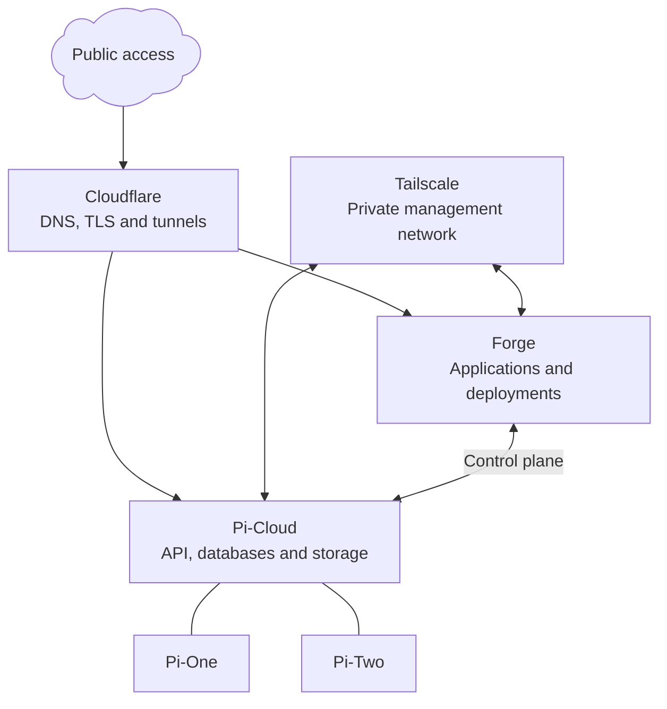

# denizlg24.com

This is the monorepo behind [denizlg24.com](https://denizlg24.com), my public
website, personal applications, and self-hosted infrastructure.

Most applications here are purpose-built for my own workflows. The public
projects are Envoy with its Rust CLI, and Macros.

## Public projects

### Envoy

[Envoy](https://envoy.denizlg24.com) is encrypted, Git-style version control
for environment files. It stores encrypted blobs and commit history while
keeping plaintext secrets and encryption keys on the user's machine.

- [Envoy service source](apps/envoy)
- [Envoy CLI source and documentation](apps/envoy-cli)
- [Envoy CLI on crates.io](https://crates.io/crates/envoy-cli)

### Macros

[Macros](https://macros.denizlg24.com) is a nutrition tracker for iPhone and
Android: food logging from a shared catalogue, barcode and label scanning,
weight trends and energy-expenditure estimates.

- [iPhone and Android app source](apps/macros-mobile)
- [API and website source](apps/macros)
- [Nutrition catalogue API](apps/nutrition)
- [Changelog](https://macros.denizlg24.com/changelog)

## Repository map

### Applications

| Path | Description | Audience |
| --- | --- | --- |
| `apps/web` | Public website, writing, projects, and private administration | Personal |
| `apps/desktop` | Native life-dashboard client built with Tauri | Personal |
| `apps/authenticator-extension` | Chrome and Firefox extension holding an offline authenticator vault | Personal |
| `apps/macros` | Macros API and website | Public |
| `apps/macros-mobile` | Macros for iPhone and Android, built with Expo | Public |
| `apps/macros-vision` | Python service for nutrition-label OCR and food-photo classification | Public |
| `apps/nutrition` | Food catalogue API combining USDA, national composition tables and OpenFoodFacts | Public |
| `apps/api` | API and OAuth 2.1 authorization server for my self-hosted cloud | Personal |
| `apps/auth` | Sign-in, consent and OAuth client management for every application | Personal |
| `apps/mcp` | MCP server exposing the infrastructure's administration as tools | Personal |
| `apps/browser` | MCP server giving the in-app agent a headless Chromium | Personal |
| `apps/sandbox` | Short-lived containers that run the agent's generated code | Personal |
| `apps/status` | Public status page with incident detection and triage | Personal |
| `apps/cloud` | Administration interface for cloud services | Personal |
| `apps/forge` | Deployment dashboard: build history, containers, logs, and host telemetry | Personal |
| `apps/deploy-agent` | Executor on the deploy host that builds images and runs containers | Personal |
| `apps/email-classifier` | Python Logistic Regression Email Classifier API | Personal |
| `apps/markets-relay` | Bun WebSocket relay fanning out Tiingo market quotes | Personal |
| `apps/storage` | Browser-based file manager | Personal |
| `apps/storage-metadata` | Privileged metadata, checksum, and tiering service for the storage namespace | Personal |
| `apps/terminal` | Web-terminal daemon for the cloud host | Personal |
| `apps/envoy` | Envoy website and encrypted-storage API | Public |
| `apps/envoy-cli` | Rust command-line client for Envoy | Public |
| `apps/ssh-server` | Go based ssh-server that powers my business card | Personal |
| `infra/*` | Deployment definitions for self-hosted services | Personal |

### Packages

| Path | Description |
| --- | --- |
| `packages/schemas` | Canonical wire contracts as Zod schemas; every application type is inferred from here |
| `packages/ui` | Design system and component library shared by every browser interface |
| `packages/admin` | Shared administration feature screens rendered by both the website and the desktop client |
| `packages/markets` | Portfolio engine, pricing logic, and market data contracts |
| `packages/latex-editor` | Reusable multi-file LaTeX editing workspace with compile log and preview |
| `packages/whiteboard-render` | Server-side rendering of whiteboard documents to SVG |
| `packages/cloud-core` | Self-hosted cloud logic: database schema, S3 storage, projects, operations, sync |
| `packages/cloud-ui` | Shared interface pieces for the cloud and storage applications |
| `packages/cloud-auth-client` | Client-side authentication for the cloud applications |
| `packages/macros-core` | Macros domain logic shared by its API and app: nutrients, servings, weight trend, expenditure |
| `packages/auth-ui` | Sign-in and consent flow screens for the auth application |
| `packages/tts` | Text-to-speech model catalogue and narration chunking |
| `packages/utils` | Shared helpers for money, recurrence, payroll, tree structures, and changelog parsing |
| `packages/typescript-config` | Shared TypeScript configuration presets |

## Architecture

The TypeScript applications are organized as Bun workspaces and coordinated by
Turborepo. Next.js and React power the browser interfaces, Tauri packages the
desktop application, Expo builds the Macros app, and shared packages keep
contracts and UI consistent across applications.

One identity covers everything: the cloud API is also the OAuth 2.1
authorization server, `apps/auth` is its interface, and every other
application is a client or a resource server of it.

The self-hosted cloud runs a Bun and Hono API backed by PostgreSQL, MongoDB,
Redis, and S3-compatible storage. Forge is the deployment platform on top of
it: the API holds the control plane and `deploy-agent` builds images and runs
containers on the host. Envoy combines a Next.js service with a Rust CLI and
shares versioned API fixtures across both implementations.

## Running infrastructure

Forge runs the applications and deployments; the status page is the one
application left on Vercel. Pi-Cloud hosts the cloud API, databases, storage
and search, with Pi-One and Pi-Two connected to it. Cloudflare
provides public access; Tailscale provides the private management network.

See [disaster recovery](docs/dr/README.md) for what is protected, how the
backup and recovery flow works, and the retention policy behind it.

## Technology

- Bun, TypeScript, Turborepo
- Next.js, React, Tailwind CSS
- Expo and React Native for the Macros app, with Swift modules for HealthKit
- Vite and Manifest V3 for the browser extension
- Rust and Tauri
- Go, Python, FastAPI
- Hono, Elysia, PostgreSQL, MongoDB, Redis, Meilisearch
- Better Auth, OAuth 2.1, Model Context Protocol
- Prisma and Drizzle
- Docker, GitHub Actions, Forge, Vercel

This repository is public for transparency and as a record of the systems I
build and operate. Personal applications are tailored to my environment and
are not presented as reusable products.
