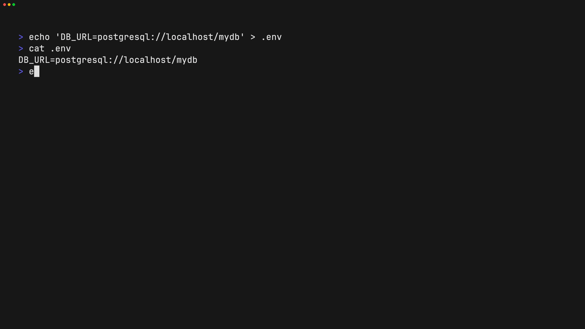
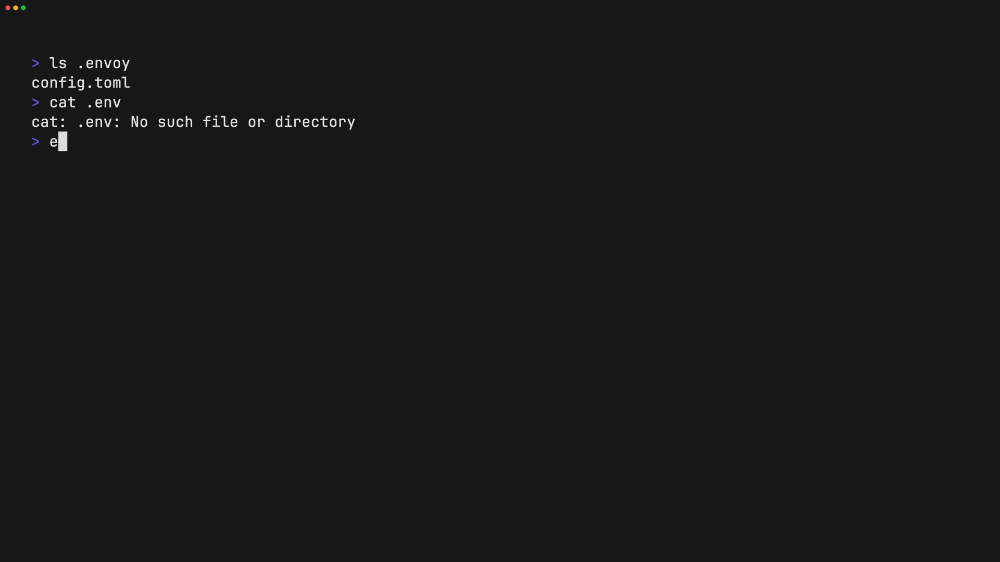

# Envoy

**Envoy** is a secure, Git-like CLI for managing encrypted environment files across machines and teams.

It lets you **encrypt once**, **sync safely**, and **restore automatically** — without ever committing secrets to Git.

Development lives in the
[`denizlg24.com` monorepo](https://github.com/denizlg24/denizlg24.com/tree/main/apps/envoy-cli).
CLI release assets remain published from the
[`envoy` release mirror](https://github.com/denizlg24/envoy/releases).
Versioned API fixtures live in `contracts/v1`; both the Rust CLI and the
monorepo's Zod schemas validate them to prevent protocol drift.

## Repository and release flow

The monorepo is the canonical development source. After changes under
`apps/envoy-cli` land on `main`, the monorepo's
`sync-envoy-cli.yml` workflow splits this directory and fast-forwards the
`master` branch of `denizlg24/envoy`.

Tags and CLI releases continue to be created in `denizlg24/envoy`, where the
existing release workflow builds installers and update assets. Installer and
self-update URLs therefore intentionally use the release mirror; the monorepo
does not publish a second copy of those assets.

---

## Why Envoy?

Managing `.env` files across devices is painful:

- You can’t commit them
- Copying them manually is error-prone
- Sharing them securely is hard
- CI environments need controlled access

Envoy solves this by treating secrets like **versioned artifacts**, not source code.

---

## Core Concepts

Envoy is built around a few simple ideas:

- **Secrets are encrypted locally** (never plaintext on the server)
- **One project passphrase restores managed files**
- **Each managed file gets a unique derived encryption key**
- **Encrypted blobs are content-addressed** (SHA-256)
- **Commits track manifest history** (like Git)
- **File access can be restricted to selected project members**
- **Git tracks intent, not data**
- **Cache is disposable**
- **Remotes behave like Git remotes**

If you understand Git, Envoy will feel familiar.

---

## Installation

### Quick Install

**macOS/Linux:**

```bash
curl -fsSL https://raw.githubusercontent.com/denizlg24/envoy/master/install.sh | bash
```

**Windows (PowerShell):**

```powershell
iwr -useb https://raw.githubusercontent.com/denizlg24/envoy/master/install.ps1 | iex
```

### From Source

#### Requirements

- Rust (stable)
- Cargo

```bash
cargo install envoy-cli
```

Or build locally:

```bash
git clone https://github.com/denizlg24/denizlg24.com.git
cd denizlg24.com/apps/envoy-cli
cargo build --release --locked
```

---

## Authentication

Envoy uses GitHub OAuth (device flow).

```bash
envy login
```

This stores an API token in:

```bash
$HOME/.envoy/config.toml
```

Logout at any time:

```bash
envy logout
```

---

## Getting Started

### 1. Initialize a project

```bash
envy init
```

This creates the `.envoy/` directory and sets up the default remote (`origin`).

### 2. Stage files

`add` encrypts and stages a file (default `.env`) with the project passphrase.
Run it again after editing, just like `git add`.

```bash
envy add
envy add --input .env.testing
```

`envy encrypt` remains available for backwards-compatible per-file passphrases.

### 3. Commit changes

```bash
envy commit -m "Add production secrets"
```

- Creates an encrypted commit object
- Links to the current manifest state
- Updates local HEAD

### 4. Push to remote

```bash
envy push
```

- Uploads encrypted blobs and commits
- Updates remote HEAD

### 5. Pull and restore secrets

```bash
envy pull
```

- Downloads encrypted blobs and commits
- Decrypts them locally
- Restores files to their original paths

### 6. Check status

```bash
envy status
```

- Shows current manifest state
- Displays uncommitted changes
- Fetches remote to show sync status

### 7. Inspect changes

```bash
envy diff              # working tree versus staged files
envy diff --cached     # staged files versus HEAD
```

Envoy shows variable names but redacts values by default. Use
`--show-secrets` only when plaintext terminal output is acceptable.

### 8. Remove a tracked file

```bash
envy rm --input .env.testing
```

This stages the deletion and deletes the working-tree file. Add `--cached` to
stop tracking while keeping the local file. Pull applies committed deletions,
but refuses to delete a locally modified managed file.

### 9. Restrict a file to selected members

Use the internal user IDs shown by `envy member list`:

```bash
envy access grant .env.production USER_ID
envy access revoke .env.production USER_ID
envy access list .env.production
envy access unrestrict .env.production
```

The project owner publishes access changes with the next commit and push.

---

## Quick demos

The following animated demos show common Envoy workflows.

### Initialize a project


### Encrypt a file



### Pull and restore secrets



---

## Configuration

### Project config (tracked)

`.envoy/config.toml`

```toml

version = 1
project_id = "..."
name = "..."

default_remote = "origin"

[remotes]
origin = "https://envoy.denizlg24.com/api"

```

### Local state (not tracked)

```
.envoy/HEAD                      # Current commit hash
.envoy/refs/remotes/origin/HEAD  # Remote HEAD
.envoy/latest                    # Current manifest blob hash
.envoy/cache/                    # Encrypted blobs and commits
$HOME/.envoy/sessions.json       # Encrypted, expiring project-key sessions
```

---

## Commands

| Command | Description |
|---------|-------------|
| `envy init` | Initialize a new project |
| `envy add` | Encrypt and stage a file with the project passphrase |
| `envy encrypt` | Legacy per-file passphrase encryption |
| `envy rm` / `envy remove` | Stage a deletion and delete the working file |
| `envy diff [--cached]` | Show redacted working or staged changes |
| `envy commit -m "msg"` | Create a commit |
| `envy log` | View commit history |
| `envy status` | Show current state |
| `envy push` | Push commits to remote |
| `envy pull` | Pull and restore secrets |
| `envy access ...` | Manage per-file member access |
| `envy member ...` | Manage project members |
| `envy login` | Authenticate with GitHub |
| `envy logout` | Clear authentication |

---

## Non-interactive automation

Every command input can be supplied as an argument or as a newline-delimited
`key=value` record on stdin. Arguments take precedence over piped values, and
values may contain `=` characters.

```bash
printf '%s\n' \
  'input=.env.production' \
  'passphrase=project-passphrase' |
  envy add
```

Managed files need only the project passphrase:

```bash
printf '%s\n' 'passphrase=project-passphrase' | envy pull
```

For legacy files created with `envy encrypt`, map their passphrases explicitly:

```bash
printf '%s\n' \
  'passphrase=project-passphrase' \
  'file:.env=development-passphrase' \
  'file:.env.production=production-passphrase' |
  envy pull
```

Use `file:*=shared-passphrase` when every file uses the same passphrase. The
equivalent arguments are `--file-passphrase "FILE=PASSPHRASE"` (repeatable) and
`--file-passphrase-all PASSPHRASE`.

Prefer stdin for secrets because command-line values may be visible in shell
history and process listings. See [`skills/use-envoy/SKILL.md`](skills/use-envoy/SKILL.md)
for the complete agent-oriented input matrix.

Remote commands normally read the API token created by `envy login`. In CI,
provide that token through `ENVOY_API_TOKEN` instead of creating a persistent
config file. Keep the project passphrase in a separate secret and pipe it to
stdin:

```yaml
- name: Restore environment
  env:
    ENVOY_API_TOKEN: ${{ secrets.ENVOY_API_TOKEN }}
    ENVOY_PASSPHRASE: ${{ secrets.ENVOY_PASSPHRASE }}
    ENVOY_HOME: ${{ runner.temp }}/envoy
    ENVOY_NO_UPDATE_CHECK: "1"
  shell: bash
  run: printf 'passphrase=%s\n' "$ENVOY_PASSPHRASE" | envy pull
```

Do not put either secret in command arguments, workflow YAML, artifacts, or
cache keys. Scope the API token to the Envoy project member used by the
automation and rotate both secrets when access changes.

For isolated tests, set `ENVOY_HOME` to a temporary directory and
`ENVOY_NO_UPDATE_CHECK=1`.

---

## Security Model

- Encryption happens **client-side only**
- Keys are derived using **Argon2id** (memory-hard)
- Managed file keys are derived independently with **HKDF-SHA-256** and a
  random salt
- Data is encrypted using **XChaCha20-Poly1305** (AEAD)
- Blobs are content-addressed via **SHA-256**
- Commits are encrypted and linked by parent hash
- Server never sees plaintext or keys
- Change detection uses plaintext hashes inside the encrypted manifest
- Legacy manifest v1 and per-file passphrase blobs remain readable

Envoy is designed so the server is **untrusted by default**.

For detailed cryptographic analysis, see [IMPLEMENTATION_SECURITY.md](docs/IMPLEMENTATION_SECURITY.md).

---

## License

MIT
