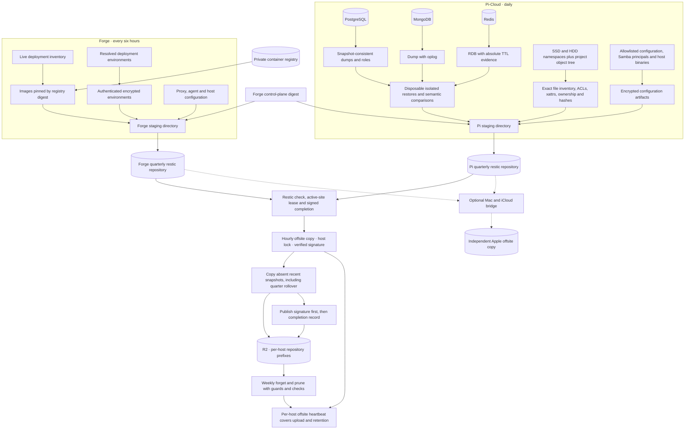
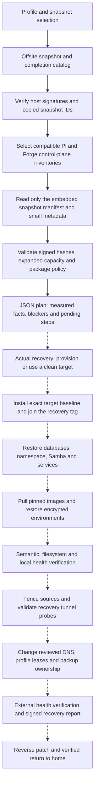
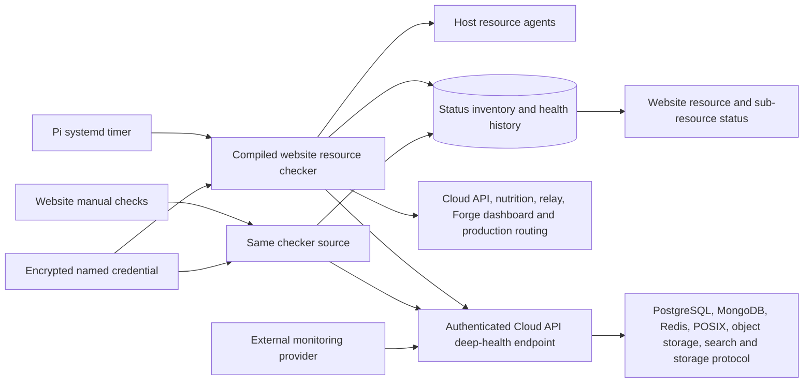

# Disaster recovery

The recovery scope is Pi-Cloud's cloud data and Forge's application
deployments. Cloudflare R2 is the unattended offsite store, with an optional
independent copy on iCloud. Recovery can target the Pi profile, the Forge
profile, or both together on a single x86_64 Ubuntu server.

This page documents what is protected, how the backup and recovery flow fits
together, and why the retention and compatibility rules are shaped the way they
are. [infra/dr](../../infra/dr/README.md) documents the implementation. The
operating procedures themselves are private.

## Backup and verification flow

A backup is offsite only when R2 holds both its restic snapshot and its signed
completion record. The originating host's repository is staging, because it
lives on the machine it protects.

Restic copies receive new snapshot IDs in the destination repository, so
recovery resolves the signed source ID through the destination's `original`
field and validates the embedded snapshot manifest against the signed hash. The
completion record's pack inventory describes the source repository, not R2's
repacked copy — a distinction that matters because verifying the copy against
the wrong inventory would fail for a healthy backup.

| Protected state | Captured and verified by |
| --- | --- |
| Pi PostgreSQL, including the cloud and Forge control plane | Logical dumps, global roles, isolated semantic restore |
| Pi MongoDB | Oplog dump and isolated semantic restore |
| Pi Redis | RDB, key/type/value and absolute-expiration evidence |
| SSD and HDD namespace branches | Exact archives, allocation inventory, ACLs, xattrs and full hashes |
| Independent project S3 object tree | Included with the two physical namespace branches |
| Samba identities and personal routes | Password-hash export and principal/route inventory |
| Cloud, relay and optional nutrition configuration | Explicit configuration allowlist |
| Forge production applications | Immutable registry digests, encrypted environments, deployment and domain inventory |
| Forge proxy and agent state | Configuration allowlist and service definitions |
| DNS, tailnet and monitoring providers | Redacted daily external-state export and reviewed infrastructure-as-code contracts |
| Recovery credentials | Independent restic passwords, signing keys and an offline break-glass inventory |

Search indexes are rebuilt rather than backed up. Build caches, generated
archives, partial uploads and disposable container state are deliberately not
treated as authoritative.

The scope is the two production hosts, so a few adjacent things sit outside it
by design and would need their own recovery contract before anything here could
be called whole-machine coverage: a separate game-server workload on the
storage disk, auxiliary cron and agent installations, the hosted Atlas database
that holds the public site's status history, and the remaining low-power Pi that
runs only a resource agent.

## Retention

The R2 repository for **each** host retains the union of:

| Rule | Recovery points kept |
| --- | --- |
| Safety floor | Latest 3, or every snapshot while bootstrapping with fewer |
| Recent window | Every snapshot within 14 days of the latest |
| Daily history | Latest snapshot on each of the latest 90 populated days |
| Monthly history | Latest snapshot in each of the latest 12 populated months |

Grouping is by host only. Every capture has a different staging path and every
quarter has a different tag, so grouping by either would create independent
retention groups that never converge and therefore never clean up.

Cleanup reads R2 itself and never infers deletion from local snapshot absence.
It stops for an empty or unreadable repository, invalid signatures, a missing
completion record for a retained point, future timestamps, no new offsite point
in 36 hours, a repository that changed during planning, any deletion inside the
last 14 days, or a deletion set exceeding a quarter of the snapshots. That
ceiling is reviewable within a narrow range; raising it to get past a failing
check defeats its purpose.

After preflight it verifies the repository, forgets the exact reviewed IDs,
prunes unreferenced data, verifies again, and only then deletes the obsolete
completion and signature pairs. A daily timer attempts maintenance, and a
successful run suppresses repeats for six days so that lock contention or a
failure can be retried the next day rather than waiting a week. Copy, backup
and retention share a host lock, and restic holds its own repository locks on
top of that. Retention failure is persisted until a successful retry, so a
later upload cannot silently clear its alert, and a stale retention marker
fails the offsite heartbeat on its own. Automatic unlocking is deliberately
absent: a stuck lock is a condition to look at, not to clear.

The hourly uploader copies only snapshots from the last 14 days, which is what
stops an old local repository from resurrecting snapshots that were
intentionally retired offsite. It checks every local quarter so that a quarter
boundary cannot strand a recent upload. Importing older history is an explicit
operator action rather than something the timer can decide.

Object-lifecycle expiry must not be configured on the repository's data, index,
key, snapshot or config prefixes. A retained snapshot can reference a much older
shared pack, so restic has to be the component that decides which packs are
unreachable before anything deletes them. The upstream
[retention semantics](https://restic.readthedocs.io/en/stable/060_forget.html)
and [R2 object lifecycles](https://developers.cloudflare.com/r2/buckets/object-lifecycles/)
document both halves of that interaction.

Retention bounds retained history, not the size of the live dataset. The Pi
namespace is archived and compressed before restic sees it, so deduplication is
limited whenever that large archive changes. Stored bytes and growth are
therefore reviewed alongside the policy, and no byte ceiling is allowed to
delete a last valid recovery point.

Recovery installs both offsite services and the trusted signing keys on a
recovered host but leaves their timers disabled until cutover transfers
ownership. Cutover stops the source's uploads and retention; rollback transfers
them back. Missing offsite configuration stops continuity installation before
cutover rather than after it.

## Recovery without a VPS or large local disk

Two metadata-only modes — plan and simulate — answer "could this be recovered,
and what would it need" without provisioning anything. They read the offsite
completion records, restic metadata, the signed snapshot manifest, the version
lock and the package inventory. They do not restore the namespace, databases,
configuration archives or images, and they do not load break-glass secrets or
require a signing private key, iCloud, access to a target, a provider account
or a target-sized local disk.

The resulting report carries snapshot ages, the matched deployment inventory,
the signed expanded footprint, the selected recovery packages, target disk
requirements, blockers and every phase that was not executed. A representative
combined pair requires roughly 300 GB of *target* disk; local transfer and
temporary space scale only with metadata, including restic indexes.

Exit behaviour is part of the contract. A successful metadata plan exits zero.
A valid plan carrying a known compatibility blocker exits with a distinct code
and still prints its report, because a blocked plan is a useful answer.
Authentication, corruption and missing-snapshot failures stop with a nonzero
exit. The report sets explicit false flags for writes, restore verification and
live rehearsal so that a simulation cannot be mistaken for recovery proof, and
a stale snapshot is reported rather than prompted for, since nothing here has
accepted it.

Metadata simulation replaces neither the full local preflight, which restores
payloads locally, nor a real target restore, nor the live rehearsal workflow
with its isolation and rollback proof. Recovery-time objectives and full
restore correctness are established by those exercises alone.

## Recovery package compatibility

The source hosts intentionally keep their running package versions; nothing in
the recovery path upgrades a live machine to make a restore fit. Instead
[recovery-packages.json](../../infra/dr/config/recovery-packages.json) resolves
the observed container runtime, build tooling, tunnel client and firewall
versions into one exact Ubuntu 24.04 x86_64 baseline. Where the two hosts
disagree the policy names which side wins and why: the container runtime and
tunnel client follow Forge's running versions, the firewall tooling follows
what the target distribution's shared library supports, and Samba and
Pi-specific tools retain their captured versions.

Simulation and real recovery use the same resolver. An unknown source version
or a disagreement outside that explicit policy stops recovery rather than
resolving itself silently. The policy hash and the resolved package hashes are
bound into the signed recovery preflight, so a changed baseline cannot quietly
reuse an older checkpoint, and newer snapshots additionally bind a hash of
their captured host-package inventory.

The combined baseline is validated by simulated dependency resolution against
the target distribution's repositories before it is trusted, and the real
bootstrap still checks availability and installs those exact versions. Actual
repository availability and a complete boot remain live rehearsal gates rather
than things this policy can assert.

## Resource monitoring

The public site's status page, the admin dashboard's manual checks and the
external monitoring provider all read the same deep-health endpoint, and the
scheduled checker on the Pi runs the web application's own checking code
compiled to a standalone binary rather than a second implementation that could
drift from it.

The deep endpoint returns 404 without its synthetic token, so it is not
discoverable by probing. Stored checks reference the credential by name only;
the token itself is encrypted with the existing server key and is sent only to
the exact endpoint, never followed through a redirect. One response feeds every
component row, so a single request covers the whole dependency set. When the
aggregate reports a failure, healthy components are still evaluated from their
own status in that response instead of all being marked down together — an
aggregate failure means something is wrong, not that everything is.

Database checks assert real dependency transactions rather than a TCP
connection, and the dashboard and production route checks mirror the external
provider's, so the two sources of truth can be compared directly. Retired hosts
keep their history and stop being checked.

## Validation

The offline test suite exercises real, tiny restic repositories and signing
keys, metadata-only reads, tampering rejection, retention safety floors, stale
and future snapshots, excessive deletion, compatible-pair selection and package
mismatch handling. Web tests cover credential destinations, redirect
protection, shared probes and component-specific failures.

Those tests are evidence about the implementation, not about the system. Full
data-read verification and live restore and rehearsal evidence are separate
gates, and nothing in this document claims they have been passed.
